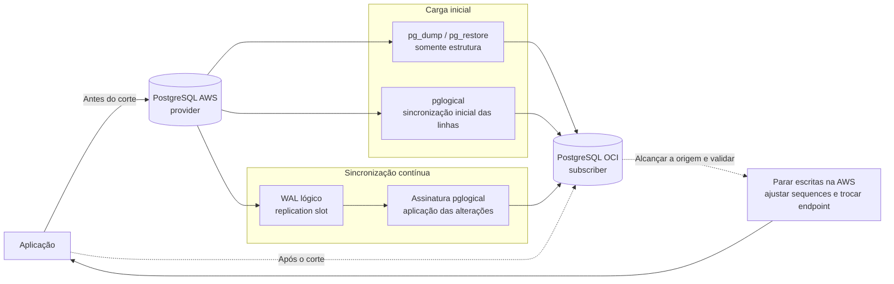

# Migração de PostgreSQL da AWS para OCI com pglogical

## Objetivo e escopo

Este procedimento migra **uma base PostgreSQL por vez** da AWS para a OCI com carga inicial e replicação contínua de alterações. A aplicação continua escrevendo na origem durante a sincronização; no corte, as escritas são interrompidas, o destino alcança a origem e a aplicação passa a usar a OCI.

O exemplo usa **Amazon RDS for PostgreSQL** como origem e **OCI Database with PostgreSQL** como destino. As diferenças para Aurora PostgreSQL, PostgreSQL em EC2 e PostgreSQL em OCI Compute estão indicadas adiante. Substitua `appdb`, `app`, usuários, hosts e caminhos pelos valores do ambiente. Execute primeiro em homologação.



O `pglogical` replica linhas de tabelas selecionadas. **Não é uma cópia completa do cluster:** roles, permissões, extensões, definições de objetos e DDL comum exigem tratamento separado. A sincronização inicial descrita aqui é feita pelo próprio `pglogical` (`synchronize_data := true`), portanto **não carregue previamente os dados nas mesmas tabelas do destino**. [Limitações do pglogical](https://github.com/2ndQuadrant/pglogical#limitations-and-restrictions) · [Tutorial da OCI](https://docs.oracle.com/en/learn/oci-pglogical-extension/index.html)

## Decisões antes da execução

| Item | Registrar |
| --- | --- |
| Origem | RDS, Aurora ou EC2; versão exata do PostgreSQL e `pglogical` |
| Destino | OCI Database with PostgreSQL ou PostgreSQL em Compute; versões disponíveis |
| Escopo | Banco, schemas, tabelas, sequences, extensões e objetos excluídos |
| Tamanho | Volume de dados, maior tabela, taxa de escrita, WAL por hora |
| Rede | Caminho privado AWS–OCI, DNS, porta 5432 e TLS |
| Corte | Janela de bloqueio de escrita, critério de aceite e responsável |
| Retorno | Backup/snapshot, prazo para retorno e tratamento de escritas feitas na OCI |

Confirme a compatibilidade de versões, encoding, collation, extensões e tipos usados pela aplicação. As tabelas replicadas devem ter o mesmo schema, nome, colunas, tipos e chave primária compatível em ambos os lados. Para replicar `UPDATE`/`DELETE`, o `pglogical` exige uma chave primária ou identidade de réplica válida; `REPLICA IDENTITY FULL` não é suportado por ele. Tabelas `UNLOGGED` e temporárias, alterações em large objects (`oid`/`lo`) e DDL automática ficam fora da replicação normal. [Requisitos do pglogical](https://github.com/2ndQuadrant/pglogical#requirements) · [Limitações](https://github.com/2ndQuadrant/pglogical#limitations-and-restrictions)

### Inventário SQL na origem

```sql
SELECT version();
SHOW server_encoding;
SHOW wal_level;
SHOW max_replication_slots;
SHOW max_wal_senders;
SELECT extname, extversion FROM pg_extension ORDER BY 1;

-- Tabelas sem chave primária no schema escolhido
SELECT n.nspname AS schema_name, c.relname AS table_name
FROM pg_class c
JOIN pg_namespace n ON n.oid = c.relnamespace
WHERE n.nspname = 'app'
  AND c.relkind IN ('r', 'p')
  AND NOT EXISTS (
      SELECT 1 FROM pg_index i
      WHERE i.indrelid = c.oid AND i.indisprimary
  )
ORDER BY 1, 2;

-- Tabelas UNLOGGED
SELECT n.nspname, c.relname
FROM pg_class c JOIN pg_namespace n ON n.oid = c.relnamespace
WHERE n.nspname = 'app' AND c.relpersistence = 'u';
```

Para cada exceção, defina uma ação antes de iniciar. Evite aplicar uma chave primária ou alterar uma tabela grande em produção sem avaliar bloqueios e tempo de execução.

## 1. Preparar rede e segurança

1. Estabeleça conectividade **do banco na OCI para o endpoint de escrita da AWS**. A assinatura do `pglogical` é criada no destino, que se conecta ao provider na origem. Prefira conectividade privada entre VPC e VCN; configure rotas, grupos de segurança da AWS, NSGs/security lists da OCI e DNS.
2. Libere TCP 5432 somente entre os endereços necessários. Confirme também que o banco OCI alcança seu próprio endpoint usado em `pglogical.create_node`.
3. Use TLS. Os exemplos abaixo usam `sslmode=require`; para validação de identidade do servidor, teste `sslmode=verify-full` com a CA correta disponível **ao processo PostgreSQL do subscriber**. Um teste de `psql` em bastion não comprova que o serviço gerenciado consegue acessar esse arquivo de CA.
4. Crie usuários de migração com os privilégios exigidos pelo serviço e acesso às tabelas do escopo. Planeje como fornecer o segredo ao `provider_dsn`: a string pode ficar registrada em comandos e catálogos; não use uma senha de aplicação reutilizada. Restrinja acesso e faça rotação após o corte.

## 2. Habilitar pglogical na AWS

### RDS for PostgreSQL

Em um **DB parameter group personalizado**, acrescente `pglogical` a `shared_preload_libraries` sem remover as bibliotecas atuais e defina `rds.logical_replication = 1`. Aplique o grupo e **reinicie** a instância na janela planejada. A configuração requer privilégios de `rds_superuser`; a conta que fará replicação precisa dos privilégios de replicação e leitura apropriados. Dimensione `max_replication_slots`, `max_wal_senders` e conexões para as assinaturas e tarefas de sincronização. [Configuração oficial do RDS](https://docs.aws.amazon.com/AmazonRDS/latest/UserGuide/Appendix.PostgreSQL.CommonDBATasks.pglogical.basic-setup.html) · [Replicação lógica no RDS](https://docs.aws.amazon.com/AmazonRDS/latest/UserGuide/PostgreSQL.Concepts.General.FeatureSupport.LogicalReplication.html)

### Aurora PostgreSQL

Use um **DB cluster parameter group personalizado**; configure `shared_preload_libraries` e `rds.logical_replication = 1`, depois reinicie a **instância writer** conforme a documentação da AWS. O subscriber deve apontar para o endpoint writer, não para um reader. [Configuração oficial do Aurora](https://docs.aws.amazon.com/AmazonRDS/latest/AuroraUserGuide/Appendix.PostgreSQL.CommonDBATasks.pglogical.basic-setup.html)

### PostgreSQL em EC2

Instale uma versão do pacote `pglogical` compatível com a versão do PostgreSQL em ambos os servidores. Configure `shared_preload_libraries = 'pglogical'`, `wal_level = logical`, slots, WAL senders e `pg_hba.conf`; reinicie o PostgreSQL para os parâmetros que exigem reinício. Verifique firewall e TLS. [Instalação e requisitos do pglogical](https://github.com/2ndQuadrant/pglogical#installation)

Depois da reinicialização, conecte-se **ao banco que será migrado** e confirme:

```sql
SHOW shared_preload_libraries;
SHOW wal_level;  -- esperado: logical
SHOW max_replication_slots;
SHOW max_wal_senders;
SELECT name, default_version, installed_version
FROM pg_available_extensions WHERE name = 'pglogical';

CREATE EXTENSION IF NOT EXISTS pglogical;
```

Repita `CREATE EXTENSION` em cada database incluído; uma assinatura é configurada por database.

## 3. Habilitar pglogical na OCI

No **OCI Database with PostgreSQL**, crie ou ajuste uma configuração personalizada habilitando a extensão `pglogical`, associe-a ao DB system e aguarde o estado ativo. No tutorial de replicação da OCI, essa configuração também define `wal_level = logical` e `track_commit_timestamp = 1`; valide os parâmetros efetivos conforme a versão e a topologia escolhidas. Crie a extensão no banco de destino. A OCI lista `pglogical` como extensão suportada que precisa ser habilitada na configuração. [Extensões suportadas](https://docs.oracle.com/en-us/iaas/Content/postgresql/extensions.htm) · [Procedimento da OCI](https://docs.oracle.com/en/learn/oci-pglogical-extension/index.html)

```sql
SHOW oci.admin_enabled_extensions;
SHOW shared_preload_libraries;
SELECT name, default_version, installed_version
FROM pg_available_extensions WHERE name = 'pglogical';

CREATE EXTENSION IF NOT EXISTS pglogical;
```

Se o destino for **PostgreSQL em OCI Compute**, instale o pacote compatível e ajuste `shared_preload_libraries`, slots, conexões, `pg_hba.conf`, firewall e TLS como em uma instalação autogerenciada. Não execute `SHOW oci.admin_enabled_extensions` nesse caso.

## 4. Preparar a estrutura no destino

Crie o banco de destino com encoding/collation compatíveis e recrie as roles de aplicação, schemas, tipos, tabelas, índices, constraints, funções e extensões necessárias. A OCI documenta o uso de `pg_dump` e `pg_restore` para migrar a estrutura. Evite restaurar objetos internos do `pglogical` ou privilégios de superusuário que o serviço gerenciado não oferece. [Importação e exportação na OCI](https://docs.oracle.com/en-us/iaas/Content/postgresql/import-export-migrate.htm)

Exemplo para **um schema de aplicação**; execute em um host administrativo com acesso aos dois bancos:

```bash
pg_dump -h AWS_HOST -U DUMP_USER -d appdb \
  --schema=app --schema-only --format=custom \
  --file=app_schema.dump

pg_restore -h OCI_HOST -U OCI_ADMIN -d appdb \
  --schema-only --no-owner --no-acl --exit-on-error \
  app_schema.dump
```

Revise `pg_restore --list app_schema.dump` antes de restaurar, especialmente extensões, owners, grants, objetos dependentes de outros schemas e funções com requisitos de superusuário. **As tabelas do escopo precisam estar vazias** antes da sincronização inicial pelo `pglogical`. Pause DDL nos objetos replicados desde a validação da estrutura até o corte; quando uma DDL for necessária, aplique-a de modo coordenado nos dois lados ou use `pglogical.replicate_ddl_command` após testar a compatibilidade. [Limites de DDL do pglogical](https://github.com/2ndQuadrant/pglogical#ddl)

## 5. Configurar provider na AWS

Conecte-se ao banco **origem**. O DSN do node precisa conter um endereço da origem alcançável pelo destino. Substitua as credenciais de exemplo por um mecanismo de segredo aprovado no ambiente.

```sql
SELECT pglogical.create_node(
  node_name := 'aws_provider',
  dsn := 'host=AWS_WRITER_HOST port=5432 dbname=appdb user=REPL_USER password=SENHA sslmode=require'
);

SELECT pglogical.replication_set_add_all_tables(
  'default', ARRAY['app']
);

SELECT pglogical.replication_set_add_all_sequences(
  'default', ARRAY['app']
);

SELECT * FROM pglogical.tables ORDER BY 1, 2;
```

Adicione somente tabelas com estrutura e identidade de réplica compatíveis. `replication_set_add_all_tables` inclui as tabelas **existentes naquele momento**; novas tabelas não entram automaticamente. Para um escopo controlado, use `pglogical.replication_set_add_table('default', 'app.minha_tabela')` por tabela. [Replication sets](https://github.com/2ndQuadrant/pglogical#replication-sets)

## 6. Configurar subscriber na OCI

Conecte-se ao banco **destino**. O node local tem nome distinto; a assinatura aponta para o endpoint de escrita da AWS. `synchronize_structure := false` mantém a estrutura preparada na etapa 4, e `synchronize_data := true` inicia a cópia das linhas e depois aplica as mudanças capturadas. [API de assinatura do pglogical](https://github.com/2ndQuadrant/pglogical#subscription-management) · [Exemplo da AWS](https://docs.aws.amazon.com/AmazonRDS/latest/UserGuide/Appendix.PostgreSQL.CommonDBATasks.pglogical.setup-replication.html)

```sql
SELECT pglogical.create_node(
  node_name := 'oci_subscriber',
  dsn := 'host=OCI_WRITER_HOST port=5432 dbname=appdb user=OCI_REPL_USER password=SENHA sslmode=require'
);

SELECT pglogical.create_subscription(
  subscription_name := 'sub_aws_oci',
  provider_dsn := 'host=AWS_WRITER_HOST port=5432 dbname=appdb user=REPL_USER password=SENHA sslmode=require',
  replication_sets := ARRAY['default'],
  synchronize_structure := false,
  synchronize_data := true
);
```

A criação da assinatura retorna antes do término da cópia. **Não libere a aplicação no destino nesse momento.** Se houver muitos databases, repita a preparação e a assinatura para cada um.

## 7. Monitorar a sincronização

No **destino**:

```sql
SELECT * FROM pglogical.show_subscription_status();
-- Para investigar uma tabela específica:
SELECT * FROM pglogical.show_subscription_table('sub_aws_oci', 'app.minha_tabela');

-- Aguarda a sincronização inicial; pode permanecer executando por muito tempo.
SELECT pglogical.wait_for_subscription_sync_complete('sub_aws_oci');
```

Na **origem**:

```sql
SELECT application_name, state, client_addr, sent_lsn, write_lsn,
       flush_lsn, replay_lsn
FROM pg_stat_replication;

SELECT slot_name, plugin, active, restart_lsn, confirmed_flush_lsn,
       pg_size_pretty(pg_wal_lsn_diff(pg_current_wal_lsn(), restart_lsn))
         AS wal_retido_aproximado
FROM pg_replication_slots
WHERE database = current_database();
```

Monitore também armazenamento, WAL, CPU, I/O, conexões e logs de ambos os serviços. Um slot parado pode reter WAL na AWS até esgotar o armazenamento. **Não remova o slot para liberar espaço sem um plano de reconstrução da assinatura.** [Slots do PostgreSQL](https://www.postgresql.org/docs/current/warm-standby.html#STREAMING-REPLICATION-SLOTS) · [Monitoramento da OCI](https://docs.oracle.com/en/learn/oci-pglogical-extension/index.html)

### Validação funcional

1. Compare contagens por tabela nos dois bancos após a sincronização inicial. Para tabelas grandes, use amostras por faixa de chave e agregados/checksums por lote; contagens feitas enquanto a origem recebe escritas podem divergir momentaneamente.
2. Faça `INSERT`, `UPDATE` e `DELETE` em registros de teste e confirme o resultado no destino.
3. Confirme que todas as tabelas previstas estão em `pglogical.tables`, incluindo as criadas depois do início do projeto.
4. Teste a aplicação na OCI em modo controlado, incluindo funções, permissões, consultas críticas e integrações externas.
5. Verifique sequences individualmente. O estado delas não é sincronizado em tempo real; planeje sua atualização no corte. [Sequences no pglogical](https://github.com/2ndQuadrant/pglogical#sequences)

## 8. Corte para a OCI

1. Confirme backup/snapshot utilizável, janela aprovada, plano de retorno, dashboards e critério de aceite.
2. Suspenda jobs e **escritas da aplicação na origem**. Deixe conexões terminarem e evite novas DDLs. Registre a hora e um marcador funcional da última transação.
3. Aguarde a assinatura terminar a sincronização inicial e alcançar a origem. No provider, após a parada das escritas, `SELECT pglogical.wait_slot_confirm_lsn(NULL, NULL);` aguarda **todos** os slots lógicos desse banco até a posição corrente; se houver outros consumidores lentos, selecione o slot desta assinatura. Confirme também o marcador e as tabelas críticas no destino. [Funções de espera do pglogical](https://github.com/2ndQuadrant/pglogical#subscription-management)
4. Para cada sequence usada pela aplicação, sincronize no provider, por exemplo `SELECT pglogical.synchronize_sequence('app.pedidos_id_seq');`, aguarde a aplicação no destino e confira que o próximo valor não colidirá com chaves existentes. Se uma sequence não estiver no replication set, ajuste-a manualmente no destino com base no valor da origem e no maior ID efetivo.
5. Compare contagens e amostras finais, estado da assinatura, erros nos logs e testes de leitura/escrita controlada.
6. Aponte a aplicação para o endpoint writer da OCI, habilite as escritas e acompanhe erros, latência e desempenho.

**Retorno:** antes de liberar escritas na OCI, é possível voltar a apontar a aplicação para a AWS conforme o plano de corte. Depois que a OCI recebe escritas, voltar apenas o endpoint para a AWS **perde essas alterações**; é necessário reconciliar dados ou preparar replicação reversa. Mantenha a origem preservada até o aceite final.

## 9. Encerramento e problemas comuns

| Sintoma | Verificação inicial |
| --- | --- |
| Assinatura `down` | Rede OCI→AWS, DNS, TLS, credenciais, logs do subscriber |
| Cópia inicial parada | Erro de tabela/constraint, privilégios, I/O e logs de sincronização |
| WAL crescendo na AWS | `pg_replication_slots.active`, `restart_lsn`, atraso e armazenamento |
| `UPDATE`/`DELETE` falham | Chave primária/identidade, estrutura divergente, constraints |
| Dados ausentes | Tabela não incluída no replication set ou criada depois dele |
| Erro após DDL | Estruturas diferentes ou transações pendentes com formato antigo |
| Chave duplicada após corte | Sequence atrasada ou valor menor que os IDs já usados |

Após o aceite, remova a assinatura e slots **somente quando não forem mais necessários para retorno ou auditoria**, registre as métricas finais e gire as credenciais de migração. Alterações em configurações de replicação lógica podem permanecer úteis para outros consumidores; não as reverta sem verificar dependências.

## Referências

- [AWS: configuração do pglogical no RDS](https://docs.aws.amazon.com/AmazonRDS/latest/UserGuide/Appendix.PostgreSQL.CommonDBATasks.pglogical.basic-setup.html)
- [AWS: configuração do pglogical no Aurora](https://docs.aws.amazon.com/AmazonRDS/latest/AuroraUserGuide/Appendix.PostgreSQL.CommonDBATasks.pglogical.basic-setup.html)
- [AWS: configuração de provider e subscriber](https://docs.aws.amazon.com/AmazonRDS/latest/UserGuide/Appendix.PostgreSQL.CommonDBATasks.pglogical.setup-replication.html)
- [OCI: extensões suportadas](https://docs.oracle.com/en-us/iaas/Content/postgresql/extensions.htm)
- [OCI: tutorial de pglogical](https://docs.oracle.com/en/learn/oci-pglogical-extension/index.html)
- [pglogical: comandos, requisitos e limitações](https://github.com/2ndQuadrant/pglogical)

**Dados necessários para adaptar os comandos:** serviço de origem, serviço de destino, versões PostgreSQL, schemas, volume de dados, conectividade AWS–OCI e janela de corte.
